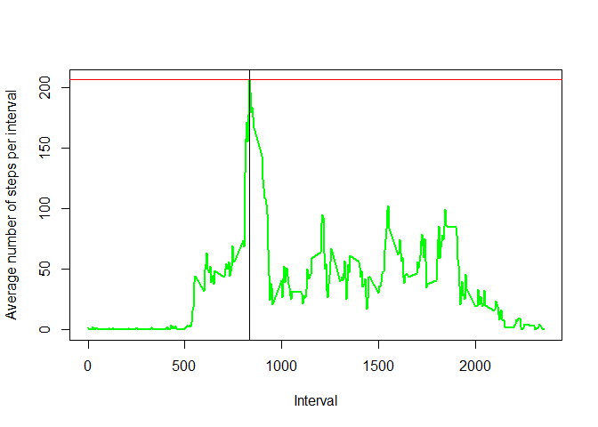
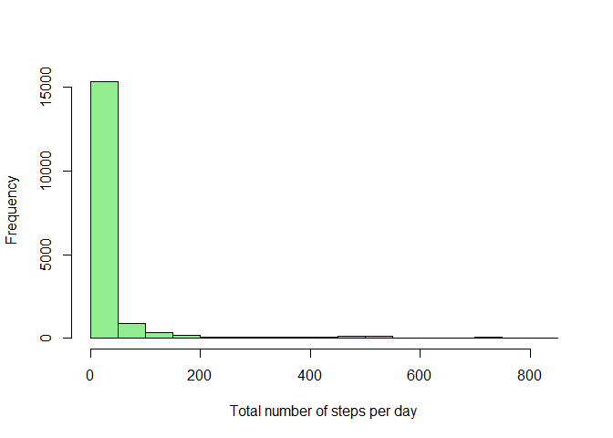
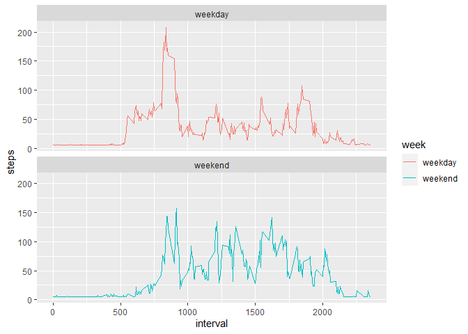

## Loading and preprocessing the data


```r
library(knitr)
require(ggplot2)
```

```
## Loading required package: ggplot2
```

```r
require(lubridate)
```

```
## Loading required package: lubridate
```

```
## Warning: package 'lubridate' was built under R version 4.0.2
```

```
## 
## Attaching package: 'lubridate'
```

```
## The following objects are masked from 'package:base':
## 
##     date, intersect, setdiff, union
```

```r
require(RColorBrewer)
```

```
## Loading required package: RColorBrewer
```

```r
require(dplyr)
```

```
## Loading required package: dplyr
```

```
## Warning: package 'dplyr' was built under R version 4.0.2
```

```
## 
## Attaching package: 'dplyr'
```

```
## The following objects are masked from 'package:stats':
## 
##     filter, lag
```

```
## The following objects are masked from 'package:base':
## 
##     intersect, setdiff, setequal, union
```

```r
library(plyr)
```

```
## ------------------------------------------------------------------------------
```

```
## You have loaded plyr after dplyr - this is likely to cause problems.
## If you need functions from both plyr and dplyr, please load plyr first, then dplyr:
## library(plyr); library(dplyr)
```

```
## ------------------------------------------------------------------------------
```

```
## 
## Attaching package: 'plyr'
```

```
## The following objects are masked from 'package:dplyr':
## 
##     arrange, count, desc, failwith, id, mutate, rename, summarise,
##     summarize
```

```r
require(ggthemes)
```

```
## Loading required package: ggthemes
```

```
## Warning: package 'ggthemes' was built under R version 4.0.3
```

```r
library(scales)
library(data.table)
```

```
## 
## Attaching package: 'data.table'
```

```
## The following objects are masked from 'package:dplyr':
## 
##     between, first, last
```

```
## The following objects are masked from 'package:lubridate':
## 
##     hour, isoweek, mday, minute, month, quarter, second, wday, week,
##     yday, year
```

```r
loadData <- function(dataURL="", destF="default.csv", method = NULL){
  if(!file.exists(destF)){
            temp <- tempfile()
            download.file(dataURL, temp, method = method)
            unzip(temp, destF)
            unlink(temp)
        }else{
            message("Data already downloaded.")
        }
}

dataURL <-"https://d396qusza40orc.cloudfront.net/repdata%2Fdata%2Factivity.zip"
loadData(dataURL, "activity.csv")
```

```
## Data already downloaded.
```

```r
#
active <- read.csv("activity.csv")
active$date<-as.Date(active$date)
head(active)
```

```
##   steps       date interval
## 1    NA 2012-10-01        0
## 2    NA 2012-10-01        5
## 3    NA 2012-10-01       10
## 4    NA 2012-10-01       15
## 5    NA 2012-10-01       20
## 6    NA 2012-10-01       25
```


## What is mean total number of steps taken per day?

```r
total.steps <- tapply(active$steps, active$date, FUN=sum, na.rm=TRUE)
qplot(total.steps, binwidth=1000, xlab="total number of steps taken each day")
```

<!-- -->

```r
meanTotalSteps <- mean(total.steps, na.rm=TRUE)
#cat (" The mean  total number of steps taken per day is :", meanTotalSteps  )
```
The mean total number of steps per day is 9354.2295082 


## What is the average daily activity pattern?

```r
spi <- ddply(active, .(interval), summarize, steps = mean(steps, na.rm=TRUE))
max.spi <- max(spi$steps)
max.int <- spi[spi$steps==max(max.spi),1]
```
**Plot of the average number of steps taken each interval**

```r
plot(spi$interval,spi$steps, ylab="Average number of steps per interval",xlab="Interval", main=NULL, type="l", lwd=2, col="green")
abline(h=max.spi, col = c("red"))
abline(v=max.int, col = c("black"))
```

<!-- -->
The maximum number of steps per interval in average is 206.1698113 and corresponds to the interval 835.

## Imputing missing values

```r
missingValues <- dim(active[is.na(active$steps),])[1]
```
There are  2304 with missing values

**all missing values are filled in with the average value of the 5-minute intervals**

```r
active[is.na(active$steps), "steps"] <- mean(active$steps, na.rm=T)
missing <- is.na(active$steps)
# How many missing
table(missing)
```

```
## missing
## FALSE 
## 17568
```

**Histogram with  total number  of steps  taken each day and calculate and respor the mean  an median  total number of steps aken per day**

```r
spd1 <- ddply(active, .(date), summarize, steps = sum(steps))
mean.spd1 <- mean(spd1$steps, na.rm = TRUE)
median.spd1 <- median(spd1$steps, na.rm = TRUE)
hist(active$steps, xlab="Total number of steps per day", main=NULL, col="light green")
abline(v=mean.spd1, col = c("red"))
abline(v=median.spd1, col = c("green"), lty = 2)
```

<!-- -->


## Are there differences in activity patterns between weekdays and weekends?


```r
library (chron)
```

```
## Warning: package 'chron' was built under R version 4.0.3
```

```
## 
## Attaching package: 'chron'
```

```
## The following objects are masked from 'package:lubridate':
## 
##     days, hours, minutes, seconds, years
```

```r
active$day <- weekdays(as.Date(active$date))
attach(active)
d <- levels(factor(day))
active$week <- "weekday"
active[day==d[1],5]<-"weekend"
active[day==d[6],5]<-"weekend"
active$week <- as.factor(active$week)
spiw <- ddply(active, .(interval,week), summarize, steps = mean(steps, na.rm=TRUE))
max.spiw <- max(spiw$steps)
max.intw <- spiw[spiw$steps==max(max.spiw),1]
```


```r
library(ggplot2)
ggplot(data=spiw, aes(x=interval, y=steps, group=week)) + geom_line(aes(color=week))+ facet_wrap(~ week, nrow=2)
```

<!-- -->
The graphs show different patterns, the steps on the weekend are very similar than on normal days


