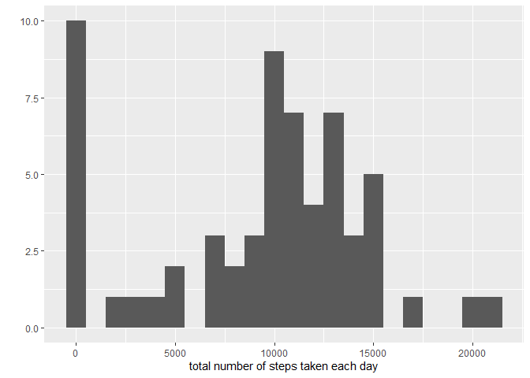

## Loading and preprocessing the data


```r
library(knitr)
require(ggplot2)
```

```
## Loading required package: ggplot2
```

```r
require(lubridate)
```

```
## Loading required package: lubridate
```

```
## Warning: package 'lubridate' was built under R version 4.0.2
```

```
## 
## Attaching package: 'lubridate'
```

```
## The following objects are masked from 'package:base':
## 
##     date, intersect, setdiff, union
```

```r
require(RColorBrewer)
```

```
## Loading required package: RColorBrewer
```

```r
require(dplyr)
```

```
## Loading required package: dplyr
```

```
## Warning: package 'dplyr' was built under R version 4.0.2
```

```
## 
## Attaching package: 'dplyr'
```

```
## The following objects are masked from 'package:stats':
## 
##     filter, lag
```

```
## The following objects are masked from 'package:base':
## 
##     intersect, setdiff, setequal, union
```

```r
require(ggthemes)
```

```
## Loading required package: ggthemes
```

```
## Warning in library(package, lib.loc = lib.loc, character.only = TRUE,
## logical.return = TRUE, : there is no package called 'ggthemes'
```

```r
library(scales)
loadData <- function(dataURL="", destF="default.csv", method = NULL){
  if(!file.exists(destF)){
            temp <- tempfile()
            download.file(dataURL, temp, method = method)
            unzip(temp, destF)
            unlink(temp)
        }else{
            message("Data already downloaded.")
        }
}

dataURL <-"https://d396qusza40orc.cloudfront.net/repdata%2Fdata%2Factivity.zip"
loadData(dataURL, "activity.csv")
```

```
## Data already downloaded.
```

```r
#
active <- read.csv("activity.csv")
active$date<-as.Date(active$date)
head(active)
```

```
##   steps       date interval
## 1    NA 2012-10-01        0
## 2    NA 2012-10-01        5
## 3    NA 2012-10-01       10
## 4    NA 2012-10-01       15
## 5    NA 2012-10-01       20
## 6    NA 2012-10-01       25
```


## What is mean total number of steps taken per day?

```r
total.steps <- tapply(active$steps, active$date, FUN=sum, na.rm=TRUE)
qplot(total.steps, binwidth=1000, xlab="total number of steps taken each day")
```

<!-- -->


## What is the average daily activity pattern?


## Imputing missing values


## Are there differences in activity patterns between weekdays and weekends?
